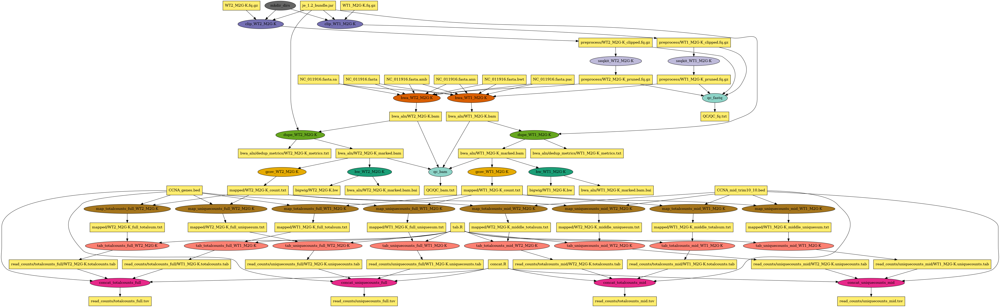

# TNseq Pegasus Workflow

A [Pegasus WMS](https://pegasus.isi.edu/) workflow for bacterial transposon insertion sequencing (TNseq) alignment and annotation. This converts the [chienlab-tnseq](https://github.com/chienlab/chienlab-tnseq) Snakemake pipeline to Pegasus, enabling distributed execution on HTCondor clusters provisioned via [FABRIC](https://fabric-testbed.net/).

## Pipeline Overview

The workflow processes multiplexed TNseq FASTQ libraries through 10 stages:

```
FASTQ ──> clip ──> seqkit_grep ──> bwa_mem ──> rm_dupe ──┬──> genomecov ──> bedtools_map (x4) ──> tab (x4) ──> concat (x4)
                                                          └──> bam2bw
          QC runs on clipped/pruned FASTQs and BAMs ──────────> seqkit_qc
```

| Step | Tool | Description |
|------|------|-------------|
| 1. clip | Je | Clip 6bp UMIs from read headers |
| 2. seqkit_grep | seqkit | Filter reads containing the transposon static region |
| 3. bwa_mem | BWA-MEM + samtools | Align reads to reference genome and sort |
| 4. rm_dupe | Je markdupes | Remove PCR duplicates using UMI-aware deduplication |
| 5. genomecov | bedtools | Extract 5' insertion positions in bedGraph format |
| 6. bedtools_map | bedtools | Map counts to gene features (4 variants: total/unique x mid/full) |
| 7. bam2bw | samtools + bamCoverage | Generate BigWig coverage tracks for genome browsers |
| 8. tab_generate | R (tab.R) | Create per-sample count tables |
| 9. concat | R (concat.R) | Merge all sample tables into final TSVs |
| 10. seqkit_qc | seqkit | Quality control statistics for FASTQs and BAMs |

### DAG Visualization

The following diagram shows the workflow DAG:



## Directory Structure

```
tnseq-workflow/
├── workflow_generator.py       # Pegasus workflow generator
├── custom_sites.py             # Writes sites.yml (HTCondor or Slurm)
├── bin/
│   ├── clip.py                 # UMI clipping wrapper
│   ├── seqkit_grep.py          # Transposon filtering wrapper
│   ├── bwa_mem.py              # Alignment wrapper
│   ├── rm_dupe.py              # PCR deduplication wrapper
│   ├── genomecov.py            # Genome coverage wrapper
│   ├── bedtools_map.py         # Gene mapping wrapper
│   ├── bam2bw.py               # BigWig generation wrapper
│   ├── tab_generate.py         # Tab file generation wrapper
│   ├── concat.py               # Sample concatenation wrapper
│   ├── seqkit_qc.py            # QC statistics wrapper
│   ├── tab.R                   # R script for individual count tables
│   ├── concat.R                # R script for merging count tables
│   └── je_1.2_bundle.jar       # Je UMI tool (Java)
├── data/
│   └── test/                   # Test FASTQ files (100K reads from NCBI SRA)
├── Apptainer/
│   └── Tnseq_Container.def     # Container definition with all bioinformatics tools
├── Docker/
│   └── Tnseq_Dockerfile        # Legacy Dockerfile, kept as a fallback
└── references/                  # C. crescentus NA1000 reference genome and gene annotations
```

## Prerequisites

- [Pegasus WMS](https://pegasus.isi.edu/) >= 5.0
- [HTCondor](https://htcondor.org/) >= 10.2
- Python 3.8+
- Apptainer (on the submit host to build, and on the worker nodes to run)

## Setup

### 1. Build the Container

```bash
cd tnseq-workflow
apptainer build Apptainer/Tnseq_Container.sif Apptainer/Tnseq_Container.def

# Verify
apptainer exec Apptainer/Tnseq_Container.sif which bwa samtools seqkit bamCoverage
```

The container bundles: Java 17, seqkit 2.5.1, bwa 0.7, samtools, bedtools, deeptools 3.5.4, and R with optparse.

No registry push — Pegasus stages the `.sif` like any other input file, and
`workflow_generator.py` looks for `Apptainer/Tnseq_Container.sif` by default
(override with `--container-sif`).

This image is **x86_64-only**: it installs the `seqkit_linux_amd64` release, so a
`.sif` built on aarch64 would contain a `seqkit` binary that cannot execute. And
Apptainer cannot build on macOS at all — build on an x86_64 Linux host. See
[`APPTAINER.md`](APPTAINER.md). The legacy `Docker/Tnseq_Dockerfile` is kept as a fallback.

<details>
<summary>Optional: publish the image to ghcr.io</summary>

Useful for sharing one build across a team or citing an immutable artifact. Needs a
GitHub token with `write:packages`.

```bash
echo "$GHCR_TOKEN" | apptainer registry login --username <github-user> \
    --password-stdin oras://ghcr.io

TAG=$(git rev-parse --short HEAD)
apptainer push Apptainer/Tnseq_Container.sif \
    oras://ghcr.io/pegasus-isi/tnseq-workflow:$TAG

# On the submit host, pull back to the path the generator expects
apptainer pull Apptainer/Tnseq_Container.sif \
    oras://ghcr.io/pegasus-isi/tnseq-workflow:$TAG
```

Do **not** put the `oras://` URL in the transformation catalog — Pegasus supports
`docker://`, `shub://`, `library://`, `shifter://` and `file://`, not `oras://`.
Treat ghcr.io as a distribution channel and keep staging the local `.sif`. Details in
[`APPTAINER.md`](APPTAINER.md).

</details>

### 2. Prepare Input Data

Place gzipped FASTQ files in a directory with the naming convention `{sample}.fq.gz`:

```
fastq_dir/
├── sample1.fq.gz
├── sample2.fq.gz
└── sample3.fq.gz
```

## Test Dataset

A test dataset is included in `data/test/` with two *Caulobacter vibrioides* (syn. *C. crescentus*) Tn-seq samples downloaded from NCBI SRA BioProject [PRJNA1064608](https://www.ncbi.nlm.nih.gov/bioproject/PRJNA1064608) (Julou & Ursell, 2024 — "Regulation of potassium homeostasis in *Caulobacter crescentus*").

| File | SRA Accession | Sample | Reads | Transposon hits | Size |
|------|---------------|--------|-------|-----------------|------|
| `WT1_M2G-K.fq.gz` | [SRR27544898](https://www.ncbi.nlm.nih.gov/sra/SRR27544898) | WT replicate 1, M2G-K media | 100,000 | 70,716 (71%) | 3.9 MB |
| `WT2_M2G-K.fq.gz` | [SRR27544897](https://www.ncbi.nlm.nih.gov/sra/SRR27544897) | WT replicate 2, M2G-K media | 100,000 | 70,801 (71%) | 4.2 MB |

These are subsets (first 100K reads) of the full sequencing runs, using only read 1 (single-end) which contains the transposon insertion information. The full BioProject contains 4 samples across two conditions (M2G and M2G-K media) sequenced on Illumina NextSeq 500.

Reference files for *C. crescentus* NA1000 (NC_011916) are included in `references/` and were obtained from the [chienlab-tnseq Zenodo release](https://doi.org/10.5281/zenodo.17852221) (Aldikacti, 2025).

### Running with Test Data

```bash
./workflow_generator.py \
    --fastq-dir data/test/ \
    --ref-fasta references/NC_011916.fasta \
    --ref-mid references/CCNA_mid_trim10_10.bed \
    --ref-full references/CCNA_genes.bed \
    --output workflow.yml
```

### Downloading Full Datasets

To download the complete samples from NCBI SRA (requires [SRA Toolkit](https://github.com/ncbi/sra-tools)):

```bash
# Install SRA Toolkit (macOS)
brew install sratoolkit

# Download full samples (single-end read 1 only)
mkdir -p data/full
for SRR in SRR27544897 SRR27544898; do
    fastq-dump --split-files --gzip "$SRR" -O data/full/
    mv "data/full/${SRR}_1.fastq.gz" "data/full/${SRR}.fq.gz"
    rm -f "data/full/${SRR}_2.fastq.gz"
done
```

The full BioProject also includes two M2G-condition samples (SRX23214404, SRX23214405) that can be downloaded similarly.

## Usage

### Generate Workflow

```bash
# Auto-discover samples from FASTQ directory
./workflow_generator.py \
    --fastq-dir /path/to/fastq/ \
    --ref-fasta references/NC_011916.fasta \
    --ref-mid references/CCNA_mid_trim10_10.bed \
    --ref-full references/CCNA_genes.bed \
    --output workflow.yml

# Or specify samples explicitly
./workflow_generator.py \
    --samples sample1 sample2 sample3 \
    --fastq-dir /path/to/fastq/ \
    --ref-fasta references/NC_011916.fasta \
    --ref-mid references/CCNA_mid_trim10_10.bed \
    --ref-full references/CCNA_genes.bed \
    --output workflow.yml
```

### CLI Options

| Option | Default | Description |
|--------|---------|-------------|
| `--fastq-dir` | (required) | Directory containing `*.fq.gz` input files |
| `--ref-fasta` | (required) | Reference genome FASTA file |
| `--ref-mid` | (required) | BED file for trimmed (mid) gene features |
| `--ref-full` | (required) | BED file for full-length gene features |
| `--samples` | auto-discover | Sample names (without `.fq.gz` extension) |
| `--transposon-seq` | `TGTATAAGAG` | Transposon static region sequence |
| `--container-sif` | `Apptainer/Tnseq_Container.sif` | Apptainer image, absolute or relative to the workflow directory |
| `-e`, `--execution-site` | `compute` | Site to plan against (the name hosted catalogs give their site) |
| `-s`, `--hosted-site-catalog` | (none; `~/.pegasusrc` if set) | Hosted site catalog to plan against, e.g. `unity.yml` |
| `--site-style` | `auto` | `auto`: keep an existing `sites.yml` entry or hosted catalog, else write `compute` as an HTCondor pool; `condor`/`slurm`: (re)write the site; `none`: leave `sites.yml` alone |
| `--queue`, `--project` | — | Batch partition and allocation account (Slurm) |
| `--site-scratch` | `./work` | Slurm shared scratch visible to workers and the submit host |
| `--site-profile`, `--tag-profile` | — | Extra profiles on the site or on tagged jobs; repeatable |
| `--shared-filesystem` | `auto` | Read inputs directly from the submit host (on for Slurm, off for HTCondor) |
| `--sites-yml` | `sites.yml` | Local site catalog |
| `-o`, `--output` | `workflow.yml` | Output workflow file |

### Sites

The workflow names no scheduler: each job states cores, memory and a
wall-clock runtime, and `custom_sites.py` writes `sites.yml` for the site.
Jobs plan against a site named `compute`. With `-s unity.yml` (or a hosted
catalog set in `~/.pegasusrc`) the hosted catalog defines it; with no options
`custom_sites.py` writes it as an HTCondor pool. For a Slurm cluster:

```bash
./workflow_generator.py --fastq-dir data/test/ ... \
    --site-style slurm --queue cpu --project my_lab
pegasus-plan --submit -s compute -o local workflow.yml
```

`custom_sites.py` also runs standalone (`./custom_sites.py --help`).

### Submit Workflow

```bash
pegasus-plan --submit -s compute -o local workflow.yml
```

### Monitor Workflow

```bash
pegasus-status <run-directory>
pegasus-statistics <run-directory>
```

## Outputs

The workflow produces the following final outputs in the `output/` directory:

| Output | Description |
|--------|-------------|
| `read_counts/totalcounts_mid.tsv` | Total insertion counts mapped to trimmed gene regions |
| `read_counts/totalcounts_full.tsv` | Total insertion counts mapped to full-length gene regions |
| `read_counts/uniquecounts_mid.tsv` | Unique insertion site counts for trimmed gene regions |
| `read_counts/uniquecounts_full.tsv` | Unique insertion site counts for full-length gene regions |
| `bigwig/{sample}.bw` | BigWig coverage tracks (one per sample) |
| `bwa_aln/{sample}_marked.bam` | Deduplicated alignment files |
| `bwa_aln/dedup_metrics/{sample}_metrics.txt` | Deduplication metrics |
| `QC/QC_fq.txt` | FASTQ quality statistics |
| `QC/QC_bam.txt` | BAM quality statistics |

The four TSV files are the primary results, containing per-gene insertion counts across all samples in a single table.

## Resource Requirements

| Step | Memory | Cores |
|------|--------|-------|
| clip | 6 GB | 1 |
| seqkit_grep | 2 GB | 4 |
| bwa_mem | 6 GB | 4 |
| rm_dupe | 6 GB | 1 |
| genomecov | 2 GB | 1 |
| bedtools_map | 2 GB | 1 |
| bam2bw | 4 GB | 2 |
| tab_generate | 2 GB | 1 |
| concat | 2 GB | 1 |
| seqkit_qc | 2 GB | 4 |

## Running on FABRIC

The workflow can also be run on the [FABRIC testbed](https://fabric-testbed.net/) by deploying a distributed Pegasus/HTCondor cluster across FABRIC sites.

### Deploy a Pegasus/HTCondor Cluster

You can provision a cluster using either of the following notebooks:

| Option | Link | Description |
|--------|------|-------------|
| FABRIC Artifact (Recommended) | [Pegasus-FABRIC Artifact](https://artifacts.fabric-testbed.net/artifacts/53da4088-a175-4f0c-9e25-a4a371032a39) | Pre-configured notebook from the FABRIC Artifacts repository |
| Jupyter Examples | [pegasus-fabric.ipynb](https://github.com/fabric-testbed/jupyter-examples/blob/f7be0c75f22544c72d7b3e3fa42bbdfd9d8bb841/fabric_examples/complex_recipes/pegasus/pegasus-fabric.ipynb) | Notebook from the official FABRIC Jupyter examples |

Both notebooks provision the following cluster architecture:

- **Submit Node** -- Central Manager running HTCondor scheduler and Pegasus WMS
- **Worker Nodes** -- Distributed execution points across multiple FABRIC sites
- **FABNetv4 Networking** -- Private L3 network connecting all nodes

### Setup Steps

1. Log into the [FABRIC JupyterHub](https://jupyter.fabric-testbed.net/)
2. Upload or clone one of the Pegasus-FABRIC notebooks above
3. Configure your desired sites and node specifications
4. Run the notebook to provision the cluster
5. Clone this repository on the submit node
6. Run the workflow using the commands shown above.

## Acknowledgments

This workflow is a Pegasus WMS adaptation of the [chienlab-tnseq](https://github.com/chienlab/chienlab-tnseq) Snakemake pipeline developed by the Chien Lab at UMass Amherst.
